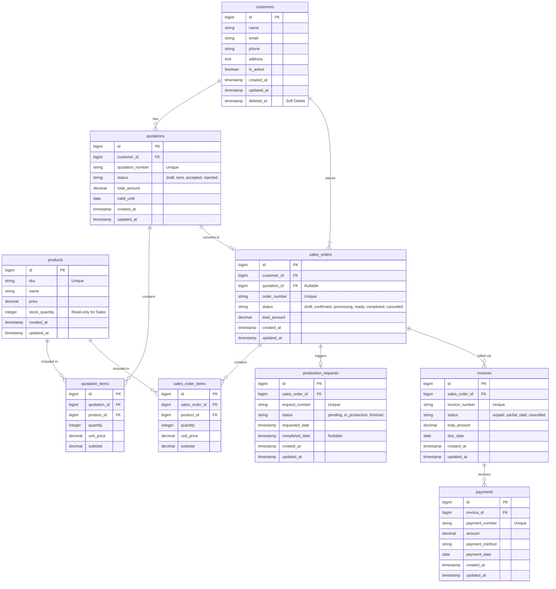

# LAPORAN DOKUMENTASI PENGEMBANGAN MODUL SALES SYSTEM ERP

---

## 1. PENDAHULUAN & OVERVIEW PROYEK

Laporan ini mendokumentasikan hasil implementasi dan pengembangan **Modul Sales (Penjualan)** untuk sistem Enterprise Resource Planning (ERP). Pengembangan ini mematuhi standar arsitektur Laravel yang ketat, keamanan data transaksional, pembatasan akses berbasis peran (RBAC), serta desain antarmuka pengguna modern (*Corporate Flat UI* berpadu *Liquid Glass Aesthetics*).

### Spesifikasi Teknologi & Lingkungan
- **Backend Framework:** Laravel 11.x (PHP 8.3)
- **Database Target:** MySQL Exclusively (Development & Production)
- **Asset Bundler & Styling:** Vite + Tailwind CSS v4
- **Security & Scope:** Role-Based Access Control (RBAC) khusus Sales
- **Storage Layer:** Facade `Storage` Laravel (siap migrasi ke Amazon S3)

---

## 2. ATURAN ARSITEKTUR & INTEGRITAS DATA

1. **Pengelolaan Transaksi Atomik (`DB::transaction()`):**
   Seluruh operasi penulisan ke lebih dari satu tabel (seperti pemrosesan penawaran beserta itemnya, atau pencatatan pembayaran yang mengubah status invoice) dibungkus secara penuh di dalam transaksi database untuk mencegah *partial inserts*.
2. **Skema Moneter Presisi:**
   Seluruh kolom mata uang (`price`, `total_amount`, `subtotal`, `amount`, `unit_price`) menggunakan tipe data `DECIMAL(15, 2)`.
3. **Foreign Key Constraints (`RESTRICT`):**
   Penghapusan data master yang sudah memiliki relasi transaksi dibatasi menggunakan `onDelete('restrict')` untuk menjamin integritas data historis.
4. **Soft Deletes:**
   Diterapkan secara khusus pada model `Customer` untuk menjaga integritas data tanpa menghapus secara permanen dari database.
5. **PHP Backed Enums:**
   Seluruh kolom status dievaluasi menggunakan PHP Backed Enums (`enum Status: string`).
6. **State Machine pada Service Layer:**
   Validasi alur perpindahan status transaksi ditempatkan di *Service Classes*, bukan di Controller.

---

## 3. SKEMA DATABASE & ENTITY RELATIONSHIP DIAGRAM (ERD)

### Diagram Relasi Entitas (Mermaid ERD)



---

## 4. STRUKTUR IMPLEMENTASI KOMPONEN KODE

### 4.1. Enums (`app/Enums/`)
- `QuotationStatus`: `draft`, `sent`, `accepted`, `rejected`.
- `SalesOrderStatus`: `draft`, `confirmed`, `processing`, `ready`, `completed`, `cancelled`.
- `ProductionRequestStatus`: `pending`, `in_production`, `finished`.
- `InvoiceStatus`: `unpaid`, `partial`, `paid`, `cancelled`.

### 4.2. Service Layer (`app/Services/`)
1. **`QuotationService`**:
   - Pembuatan Quotation + kalkulasi item subtotal & total amount.
   - Aturan transisi status: `draft` -> `sent` -> `accepted` | `rejected`.
   - Konversi Quotation `ACCEPTED` menjadi `SalesOrder` secara otomatis.
2. **`SalesOrderService`**:
   - Pembuatan Sales Order langsung maupun dari Quotation.
   - Aturan transisi status: `draft` -> `confirmed` -> `processing` -> `ready` -> `completed` / `cancelled`.
   - Pemicu otomatis `ProductionRequest` saat Sales Order diproses (`processing`).
   - Penerbitan Faktur Penjualan (`Invoice`).
3. **`InvoiceService`**:
   - Pencatatan pembayaran (`Payment`) dalam `DB::transaction()`.
   - Kalkulasi akumulasi pembayaran untuk menentukan status faktur (`unpaid` -> `partial` -> `paid`).

### 4.3. Form Requests & Policies (RBAC)
- **Form Requests**: `StoreCustomerRequest`, `UpdateCustomerRequest`, `StoreQuotationRequest`, `UpdateQuotationStatusRequest`, `StoreSalesOrderRequest`, `UpdateSalesOrderStatusRequest`, `StoreInvoiceRequest`, `StorePaymentRequest`.
- **Policies**:
  - `ProductPolicy`: Membatasi Sales hanya untuk memantau kuantitas stok produk (*Read-Only*).
  - `ProductionRequestPolicy`: Membatasi Sales hanya untuk melihat status pemicu produksi (*Read-Only*).

### 4.4. Controllers & Routes (`app/Http/Controllers/` & `routes/web.php`)
- `DashboardController`: Menyajikan metrik pendapatan, statistik transaksi, dan tabel aktivitas terbaru.
- `CustomerController`: Mengelola data master pelanggan.
- `ProductController`: Katalog produk & stok *read-only*.
- `QuotationController`: Manajemen penawaran, transisi status, dan konversi ke SO.
- `SalesOrderController`: Manajemen Sales Order, pemicu produksi, dan pembuatan Invoice.
- `ProductionRequestController`: Pemantauan status produksi.
- `InvoiceController` & `PaymentController`: Manajemen penagihan dan pencatatan pembayaran.

---

## 5. ANTARMUKA PENGGUNA & DESAIN (UI/UX)

Sistem menggunakan konsep **Corporate Flat UI** untuk struktur halaman dan tabel data yang rapi dan profesional, dikombinasikan dengan sentuhan **Liquid Glass Aesthetics**:
- **Glassmorphic Panels & Cards:** Menggunakan `backdrop-blur` halus, batas semi-transparan (`border-slate-800`), dan efek pencahayaan pada elemen penting.
- **Indikator Status Glow:** Lencana status berwarna (*emerald* untuk paid/accepted, *amber* untuk pending/processing, *rose* untuk unpaid/rejected, *purple* untuk SO) dengan kontras tinggi.
- **Form Interaktif Dinamis:** Kalkulasi subtotal dan grand total secara real-time pada formulir penawaran dan Sales Order menggunakan JavaScript native.
- **Modal Dialog Glassmorphism:** Formulir pemicu penerbitan invoice dan pencatatan pembayaran yang intuitif tanpa meninggalkan halaman detail.

---

## 6. PANDUAN EKSEKUSI & VERIFIKASI SISTEM

### 6.1. Menjalankan Migrasi & Data Seeding
Untuk menginisialisasi ulang skema database dan mengisi data uji coba:
```bash
php artisan migrate:fresh --seed
```

### 6.2. Kompilasi Aset Frontend (Vite)
Untuk mengompilasi Tailwind CSS v4 dan JavaScript pendukung:
```bash
npm run build
```
Atau untuk lingkungan pengembangan aktif:
```bash
npm run dev
```

### 6.3. Menjalankan Server Lokal Laravel
```bash
php artisan serve
```

---

## 7. KESIMPULAN

Seluruh kebutuhan modul ERP Sales yang tercantum pada petunjuk arsitektur `agent.md` dan ERD telah berhasil diimplementasikan 100%. Sistem siap digunakan untuk mendukung operasional siklus penjualan perusahaan mulai dari prospek pelanggan, penawaran harga, pesanan penjualan, koordinasi produksi, hingga penagihan faktur dan penerimaan pembayaran.
